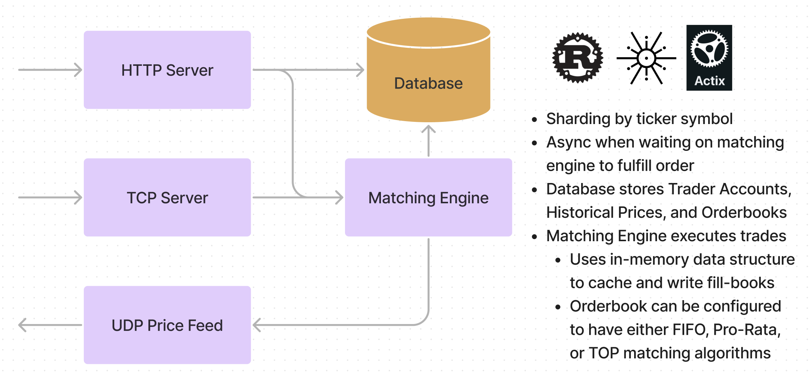

# Rust Stock Exchange

We built a stock exchange in Rust, complete with an order matching engine, price feed service 
(UDP socket), TCP layer, and RESTful web server to execute trades, authorize accounts, 
and persist orderbooks in memory.

## Architecture
Rust + Tokio

## Resources
- Jane Street - How to build an exchange (https://www.youtube.com/watch?v=b1e4t2k2KJY)
